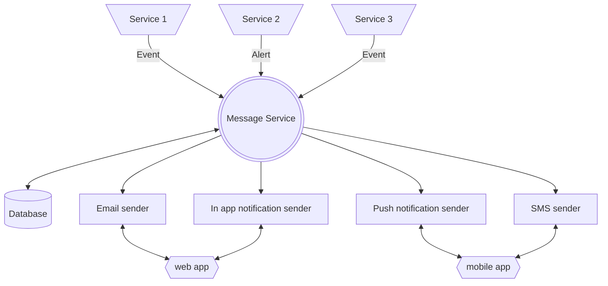
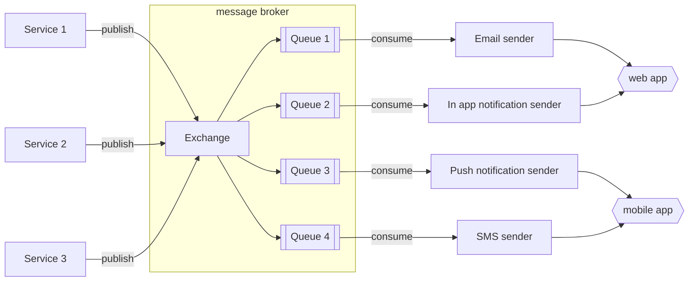

Notifications, alerts, emails, snackbars, and so on can be narrowed down to the concept of message.
At a high level, a message system should be able to generate and handle messages between services under the following rules :

# Functional Requirement:

- Send messages
- Prioritize messages
- Receive messages based on customer’s preferences
- Single/simple and bulk messages
- Reporting/monitoring/analytics of messages delivery

# Non functional requirements:

- Each service can generate a message targeted to a user or a group of users independently.
- All messages should be stored in a database
- For an online user, the message should pop up "immediately" in the UI.
- For an offline user, the message should be available in the notification tray once they log in.
- User can mark messages as read and delete older ones.
- Some messages must be "immediately" distributed others can be delayed. There is a notion of priority. 
- The system should archive or delete old messages.
- The system should not put a significant burden on the applications. It should be fast, stable and self-reliant.
- While it is not desirable to lose messages, it is ok to deliver them slightly delayed during overloads.

"Immediate" must be quantified as it can change drasticaly the way messages will be technically handled 

# Types of messages

- In app alerts & notifications
- Push notifications (mobile)
- Email
- SMS


# Modelling

- targeted user
- message
- priority/severity

```javascript
{
    "id": 1234,
    "userId": 4,
    "templateId": 6
    "title": "Lorem ipsum",
    "description": "Lorem ipsum dolor sit amet, consectetur adipiscing elit, sed do eiusmod tempor",
    "status": "NEW",
    "severity": "INFO",
    "source": "service_2",
    "displayType": "EMAIL",
    "createdAt": 1621327682,
    "deliveredAt": 1621932482,
    "archivedAt": 1627932482
}
```

# Storing

- it should be easy to push a message into the store
- it should be easy to get messages for a user or a group.
- it should be easy to get messages for a service.

Depending on the amount of messages and the speed of delivery needed, it can range from a simple SQL database to a message broker softwares like Rabbitmq or Kafka.

# High level architecture Schema



# Dealing with in app alerts & notifications

## API calls (pull)

If a small delay is acceptable, a simple call to the API in a specified time interval is the lighter way of getting in app alerts and notifications
The call can be done every 1 or 2 minutes.

## Server-Sent Events (push)

A server-sent event gives the ability for a web page to automatically get updates from a server.
This technology is built on top of HTTP.
For every user that logs in to the application, it establishes a persistent HTTP connection for the duration of the user session.
This solution is well suited for immediate in app alerts, notifications.

# Dealing with emails, SMS and push notifications

## API calls (pull)

If a delay is acceptable and the quantity of email to send is small, a simple API call from the email service to the store service via a CRON job can be OK.
The job can be triggered every few seconds.

## Message broker (push)

If you are dealing with big quantity of messages, the system can use a message broker to queue them into the right pile. Consumers will then send the messages asynchronously.


